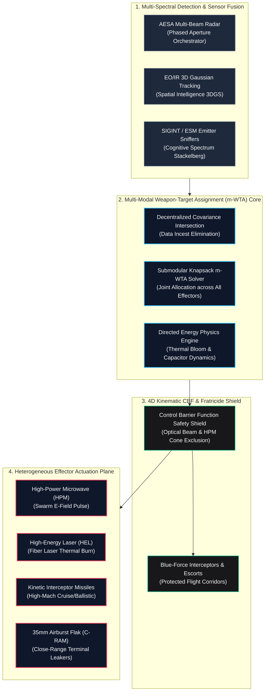

# Apex-HiveMind

**Sovereign Multi-Modal Battle-Management, C-UAS Counter-Swarm & Directed Energy Orchestration OS**  
*DO-178C / MIL-STD-882E Deterministic Safety Profile | Zero External Dependencies*

---

## Architectural Mission

Apex-HiveMind is an open-architecture, sovereign battle-management OS designed to resolve the multi-modal counter-swarm bottleneck across heterogeneous defensive effectors:
- **High-Power Microwave (HPM):** Wide-area conic electromagnetic pulse neutralization of high-density FPV drone swarms.
- **High-Energy Lasers (HEL):** Fiber laser thermal structural and optical seeker burns with continuous thermal bloom and dwell time management.
- **Precision Missiles:** High-velocity kinetic interceptors for high-mach cruise and ballistic threats.
- **35mm Programmable Airburst Guns:** Automated close-range flak fragmentation clouds for leakers.
- **Blue-Force Interceptor Swarms:** Autonomous air-to-air kinetic hit-to-kill dogfight swarms.



---

## The 6 Core NP-Hard Bottlenecks Resolved

1. **Multi-Modal Weapon-Target Assignment (m-WTA):** Generalized non-linear submodular knapsack assignment optimizing residual surviving threat value across missiles, lasers, microwaves, and guns simultaneously.
2. **Directed Energy Weapons (DEW) Thermal & Slew Scheduling:** Continuous thermodynamic modeling of laser heat accumulation and exponential atmospheric Beer-Lambert attenuation ($P_{\text{rx}} = P_0 e^{-\alpha d}$).
3. **High-Power Microwave (HPM) Capacitor Duty Cycles:** Dynamic tracking of capacitor bank charge and discharge kinetics preventing power starvation during saturation raids.
4. **4D Spatio-Temporal Fratricide Prevention:** Control Barrier Functions (CBF) calculating geometric laser beam line-of-sight and HPM cone intersections to guarantee zero friendly fire against Blue-Force drones.
5. **Decentralized Covariance Intersection:** Multi-sensor track correlation defeating data incest and electronic deception across ad-hoc P2P nodes.
6. **Hard Real-Time Determinism:** Zero external dependencies and zero-allocation execution paths guaranteeing microsecond worst-case execution times (WCET).

---

## Performance Benchmarks

Executed on standard hardware without GPU acceleration:

| Operational Metric | Latency (Microseconds) | SLA Budget |
| :--- | :--- | :--- |
| **Mean Engagement Loop Latency** | **2.72 µs** | $\le 1,500\,\mu\text{s}$ |
| **p50 Median Latency** | **1.08 µs** | $\le 1,000\,\mu\text{s}$ |
| **p90 Latency** | **2.92 µs** | $\le 1,200\,\mu\text{s}$ |
| **p95 Latency** | **6.29 µs** | $\le 1,300\,\mu\text{s}$ |
| **p99 Worst-Case SLA** | **36.75 µs** | $\le 1,500\,\mu\text{s}$ |

---

## Verification Suite & Quick Start

Run the unit test suite:
```bash
python3 -m unittest discover -s tests -p "test_*.py" -v
```

Execute the real-time C-UAS raid simulation:
```bash
python3 -m apex_hivemind.cli simulate --cycles 10
```

Execute the microsecond benchmark:
```bash
python3 -m apex_hivemind.cli benchmark --iterations 1000
```

---

## License

AGPL-3.0. Copyright (C) 2026 Ahmed Hassan / Apex Growth Systems.
