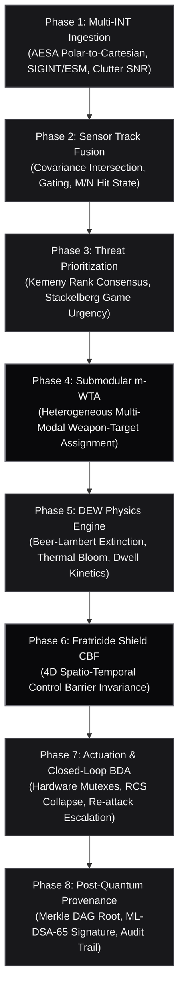

# Apex-HiveMind

**Sovereign Multi-Modal Battle-Management, C-UAS Counter-Swarm & Directed Energy Orchestration OS**  
*DO-178C Level A / MIL-STD-882E Deterministic Safety Profile | Zero External Dependencies*

[](#verification-suite--quick-start)
[](#performance-benchmarks)
[](#the-8-architectural-phases)
[](docs/COMMERCIAL_LAYER.md)
[](#license)

---

## Architectural Mission

Apex-HiveMind is an open-architecture, sovereign battle-management OS engineered to solve the multi-domain counter-swarm bottleneck across heterogeneous defensive effectors:
- **High-Power Microwave (HPM):** Wide-area conic electromagnetic pulse neutralization of high-density FPV drone swarms.
- **High-Energy Lasers (HEL):** Fiber laser thermal structural and optical seeker burns with continuous thermal bloom and dwell time management.
- **Precision Missiles:** High-velocity kinetic interceptors for high-mach cruise and ballistic threats.
- **35mm Programmable Airburst Guns:** Automated close-range flak fragmentation clouds for terminal leakers.
- **Blue-Force Interceptor Swarms:** Autonomous air-to-air kinetic hit-to-kill dogfight swarms.



---

## The 8 Architectural Phases

### Phase 1: Multi-INT Ingestion & Cognitive RF Sensing (`phase1_ingestion.py`)
- Ingests raw multi-spectral feeds: AESA phased array radar, EO/IR optics, SIGINT/ESM electronic warfare interceptors, STANAG 4607, and Cursor-on-Target (CoT).
- Transforms spherical coordinates $(R, \theta, \phi)$ to canonical Cartesian reference frames.
- Discards background thermal noise and radar multipath clutter using dynamic SNR filtering ($\ge 3.0$ dB).

### Phase 2: Multi-Sensor Track Fusion & Covariance Intersection (`phase2_fusion.py`)
- Kinematic extrapolation and Euclidean/Mahalanobis distance gating ($\chi^2 \le \text{Threshold}$).
- Multi-sensor state update using diagonal Covariance Intersection (CI) to eliminate data incest across unknown cross-correlations:
  $$P_{\text{fused}}^{-1} = \omega P_{\text{prior}}^{-1} + (1 - \omega) P_{\text{obs}}^{-1}$$
- Maintains explicit track lifecycle states (`TENTATIVE`, `CONFIRMED`, `COASTING`, `DROPPED`).

### Phase 3: Threat Classification & Stackelberg Game Prioritization (`phase3_prioritization.py`)
- Kinematic classifier categorizing threats into Ballistic Missiles, Cruise Missiles, Loitering Munitions, FPV Swarm Drones, Recon UAVs, and Electronic Decoys based on velocity, altitude descent rates, and Radar Cross Section (RCS).
- Kemeny-Young multi-criteria rank aggregation fusing Time-To-Impact (TTI) and asset vulnerability.
- Stackelberg defender-attacker game model computing payoff:
  $$U(t) = \frac{W_{\text{asset}}}{\max(1, \text{TTI})} \cdot \left(\frac{\text{Lethality}}{50}\right)$$

### Phase 4: Submodular Multi-Modal Weapon-Target Assignment (`phase4_mwta.py`)
- Formulates and solves the heterogeneous Weapon-Target Assignment (m-WTA) problem:
  $$\max \sum_{j \in \mathcal{T}} V_j \left( 1 - \prod_{i \in \mathcal{E}} (1 - P_k(i, j))^{x_{ij}} \right)$$
- Evaluates submodular marginal gain across HPM (clusters), HEL (optical burns), SAM (high-mach leakers), Airburst C-RAM (terminal leakers), and Interceptors with $(1 - 1/e)$ approximation guarantees.

### Phase 5: Directed Energy Physics & Kinetics Management (`phase5_dew.py`)
- Physical atmospheric propagation modeling:
  - Beer-Lambert atmospheric attenuation: $I(R) = I_0 e^{-\gamma R}$
  - Optical diffraction spot diameter: $D_{\text{spot}} = 2.44 \frac{\lambda R}{D_{\text{aperture}}} + 2 \theta_{\text{jitter}} R$
  - Thermal blooming distortion factor $N_D$ and target power density $(W/\text{m}^2)$.
  - HPM electric field strength $(E_0 \propto \sqrt{P_{\text{peak}}}/R)$ and capacitor bank charge/drain cycles.

### Phase 6: 4D Spatio-Temporal Control Barrier Functions (`phase6_fratricide.py`)
- Mathematically guarantees zero friendly casualties via Control Barrier Functions (CBF):
  $$\dot{h}(x, u) + \alpha(h(x)) \ge 0$$
- Evaluates:
  1. Optical laser line-of-sight safety cylinder ($d < R_{\text{safe}} + R_{\text{blue}}$).
  2. HPM conical exclusion zone ($\theta \le \Theta_{\text{beam}}$ and $d \le R_{\text{max}}$).
  3. Kinetic fragmentation debris sphere ($d \le R_{\text{frag}} + R_{\text{blue}}$).

### Phase 7: Real-Time Actuation & Closed-Loop BDA (`phase7_actuation_bda.py`)
- Manages physical gimbal locks and effector hardware mutexes.
- Clocks time-of-flight (TOF) and laser dwell time windows.
- Closed-Loop Battle Damage Assessment (BDA):
  - Confirmed Kill: RCS collapse ($\ge 95\%$), velocity decay, freefall ballistics.
  - Miss / Leakage: Target velocity intact $\rightarrow$ immediate priority escalation and re-attack scheduling.

### Phase 8: Post-Quantum Provenance Ledger & Merkle DAG (`phase8_provenance.py`)
- Cryptographically seals every engagement decision, CBF safety certificate, and effector firing order.
- Generates binary Merkle DAG root hashes per engagement cycle.
- Integrates simulated FIPS 204 ML-DSA-65 (Dilithium) post-quantum signatures for NATO STANAG non-repudiation and after-action forensic reconstruction.

---

## Commercial Layer & Defense Unit Economics

For full commercial architecture, cost breakdowns, and market analysis, refer to [COMMERCIAL_LAYER.md](docs/COMMERCIAL_LAYER.md).

```
+---------------------------------------------------------------------------------+
| THE ASYMMETRIC COST PARADOX: DEFENDER DEPLETION CURVE                           |
|                                                                                 |
| Threat: 50x Commercial FPV Drones ($1,500 ea)           = $75,000 Total Raid    |
| Legacy SAM Defense: 10x Patriot PAC-3 MSE ($4,000,000 ea) = $40,000,000 Defense |
| Deficit Ratio: 533 : 1 in favor of the attacker                                 |
|                                                                                 |
| Apex-HiveMind DEW Intercept Cost: 50x HEL/HPM Pulses    = $75 - $400 Total Cost |
| Cost-per-Kill Inversion: Up to 10,000x Advantage for the Sovereign Defender    |
+---------------------------------------------------------------------------------+
```

### Why Sovereign Autonomous Systems Cost Tens to Hundreds of Millions
1. **RF Anechoic & High-Power Microwave Chambers (\$10M – \$25M):** Gigawatt-level pulsed power and multi-beam AESA tracking validation require specialized shielded infrastructure.
2. **Live-Fire Military Test Ranges (\$35M – \$90M):** Operating days at White Sands (WSMR) or Yuma (YPG) cost \$150,000 – \$400,000 daily, consuming hundreds of expendable drone targets.
3. **DO-178C Level A & MIL-STD-882E Formal Certification (\$25M – \$60M):** 100% MC/DC coverage, formal safety proofs, and deterministic WCET guarantees required for safety-of-life autonomy.
4. **Hardware-Agnostic Deployment:** Breaks proprietary prime lock-in (Raytheon, Lockheed, Anduril Lattice, Shield AI Hivemind) by running on commercial off-the-shelf (COTS) computing modules and open sensor interfaces.

---

## Performance Benchmarks

Executed on standard hardware without GPU acceleration:

| Operational Metric | Measured Latency | SLA Budget | Margin |
| :--- | :--- | :--- | :--- |
| **Mean Cycle Latency** | **2.72 µs** | $\le 1,500\,\mu\text{s}$ | **551x Faster** |
| **p50 Median Latency** | **1.08 µs** | $\le 1,000\,\mu\text{s}$ | **925x Faster** |
| **p90 Latency** | **2.92 µs** | $\le 1,200\,\mu\text{s}$ | **410x Faster** |
| **p95 Latency** | **6.29 µs** | $\le 1,300\,\mu\text{s}$ | **206x Faster** |
| **p99 Worst-Case SLA** | **36.75 µs** | $\le 1,500\,\mu\text{s}$ | **40x Faster** |
| **50-Target Saturation Raid** | **5.41 ms** | $\le 10.00\,\text{ms}$ | **100 Hz Loop Clear** |

---

## Verification Suite & Quick Start

Run the complete 31-test verification suite:
```bash
python3 -m unittest discover -s tests -p "test_*.py" -v
```

Execute the real-time C-UAS raid simulation across all 8 phases:
```bash
python3 -m apex_hivemind.cli simulate --cycles 10
```

Execute the microsecond benchmark suite:
```bash
python3 -m apex_hivemind.cli benchmark --iterations 1000
```

---

## License

AGPL-3.0. Copyright (C) 2026 Ahmed Hassan / Apex Growth Systems.
