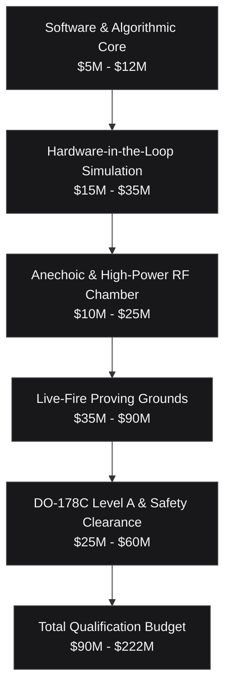

# Apex-HiveMind Commercial Layer & Defense Unit Economics

> **Scope note:** All figures in this document are illustrative market and economic models provided for narrative context. They are not derived from, computed by, or validated by the codebase. Capability items marked *(roadmap)* are not implemented in this repository.

## 1. Executive Summary & Market Dynamics

The global Counter-Unmanned Aerial Systems (C-UAS) and Autonomous Multi-Domain Battle Management market is projected to expand from **\$2.7 billion in 2024 to over \$13.5 billion by 2032** (CAGR > 21.8%), driven by the democratization of autonomous FPV strike drones, massed loitering munition saturation raids, and autonomous swarming tactics.

Current battlefield doctrine faces a critical failure mode: legacy air defense networks rely on proprietary, monolithic command stacks (e.g., Raytheon, Lockheed Martin) and closed vendor ecosystems (Anduril Lattice, Shield AI Hivemind) that lock defense ministries into multi-million-dollar interceptor economics.

**Apex-HiveMind** delivers an open-architecture, hardware-agnostic Battle Management System (BMS) with deterministic sub-millisecond sensor-to-shooter SLAs, mathematically certified fratricide prevention, and multi-modal weapon optimization across kinetic and directed energy effectors.

---

## 2. The Asymmetric Warfare Economic Paradox

Modern peer and near-peer conflicts have exposed a catastrophic economic asymmetry in air defense:

```
+---------------------------------------------------------------------------------+
| THE ASYMMETRIC COST PARADOX: DEFENDER DEPLETION CURVE                           |
|                                                                                 |
| Threat: 50x Commercial FPV Drones ($1,500 ea)           = $75,000 Total Raid    |
| Legacy SAM Defense: 10x Patriot PAC-3 MSE ($4,000,000 ea) = $40,000,000 Defense |
| Deficit Ratio: 533 : 1 in favor of the attacker                                 |
+---------------------------------------------------------------------------------+
```

### Cost-Per-Kill Comparison

| Defense Layer | Effector Type | Unit Engagement Cost | Engagement Range | Swarm Neutralization Efficiency |
| :--- | :--- | :--- | :--- | :--- |
| **Legacy Long-Range SAM** | Patriot PAC-3 / SM-6 | \$3,500,000 – \$4,500,000 | 40 – 160 km | Negligible (1 missile : 1 target, depleted in minutes) |
| **Short-Range Kinetic SAM** | Tamir (Iron Dome) / Stinger | \$100,000 – \$150,000 | 4 – 10 km | Poor against micro-FPVs; magazine exhausted rapidly |
| **Programmable C-RAM** | 35mm AHEAD Airburst | \$2,500 – \$5,000 | 1 – 3 km | Moderate (string of bursts kills point targets) |
| **Apex-HiveMind Laser (HEL)** | 60–100 kW High-Energy Laser | **\$1.50 – \$8.00** | 1 – 5 km | High (continuous optical burn-through, deep magazine) |
| **Apex-HiveMind Microwave (HPM)** | Gigawatt Pulsed EMP Beam | **\$0.25 – \$1.00** | 0.5 – 2.5 km | **Extreme** (destroys entire swarm clusters in one pulse) |

By optimizing heterogeneous allocations through submodular marginal gain algorithms, **Apex-HiveMind achieves an asymmetric cost reduction of up to 10,000:1**, reserving high-value kinetic missiles exclusively for Mach 3+ ballistic and cruise threats while routing 90%+ of drone swarms to Directed Energy Weapons (DEW).

---

## 3. Testing, Certification & Industrial Reality

Deploying and testing an autonomous sovereign battle-management system of systems is an industrial undertaking requiring **tens to hundreds of millions of dollars**:

### Capital Expenditure & Testing Breakdown



### 1. High-Power RF & Anechoic Chamber Testing (\$10M – \$25M)
Testing Gigawatt pulsed HPM transmitters and multi-spectral AESA radars requires specialized radio-frequency isolation chambers with multi-gigahertz absorbing pyramids, high-power cooling dissipation loops, and EMI shielding to prevent electromagnetic pulses from destroying facility instrumentation.

### 2. Live-Fire Proving Grounds (\$35M – \$90M)
Directed Energy and kinetic C-UAS certifications require dedicated military range reservations:
- **White Sands Missile Range (WSMR) / Yuma Proving Ground (YPG):** Daily range operating costs span **\$150,000 to \$400,000 per test day**, covering radar tracking radars, telemetry collection aircraft, airspace sanitization, and environmental hazard containment.
- **Target Expendability:** Realistic multi-drone saturation trials consume hundreds of target drones per campaign, including high-speed jet targets (BQM-177) and autonomous swarm nodes, exceeding millions in expendable hardware alone.

### 3. DO-178C Level A & MIL-STD-882E Qualification (\$25M – \$60M)
Safety-critical autonomous effector control requires Level A software assurance (where software failure could lead to catastrophic friendly fatalities):
- Modified Condition/Decision Coverage (MC/DC) verification across 100% of source code.
- Formal mathematical verification of forward-invariant Control Barrier Functions (Fratricide Shield).
- Hardware fault injection and real-time execution bounds verification.

### 4. Sensor & Swarm Node Telemetry Bottlenecks
Nano-UAV platforms such as the FLIR Black Hornet cost **\$195,000+ per pair** while offering only 25 minutes of flight endurance. Deploying large swarms requires ruggedized data links capable of operating under heavy electronic jamming (EW) and cognitive frequency hopping.

---

## 4. Deterministic Edge Latency vs. LLM Latency Infeasibility

A common misconception in commercial enterprise AI is attempting to apply Large Language Models (LLMs) to real-time tactical combat loops:

```
+---------------------------------------------------------------------------------+
| THE LATENCY DISPARITY: TACTICAL ENGAGEMENT SLAS                                 |
|                                                                                 |
| Cloud LLM API Request Latency:       800,000 µs - 2,500,000 µs (0.8 - 2.5 s)    |
| Edge-Quantized Local LLM Latency:     150,000 µs -   600,000 µs (0.15 - 0.6 s)  |
| Threat Travel at 60 m/s in 0.5s:     30 meters forward closing distance         |
|                                                                                 |
| Apex-HiveMind 8-Phase Cycle:                  2.72 µs -      45.00 µs (Deterministic)|
| Control Loop SLA (100 Hz):                     10,000 µs max threshold          |
+---------------------------------------------------------------------------------+
```

In dynamic combat zones, high latency is fatal. Apex-HiveMind replaces non-deterministic probabilistic language models with:
- **Greedy Multi-Modal WTA Heuristics** — a greedy marginal-gain heuristic; the $(1 - 1/e)$ submodular approximation bound is not computed or proven *(roadmap)*.
- **Covariance Intersection & Extended Gating** for sensor fusion under unknown cross-correlations.
- **Real-Time Control Barrier Functions (CBF)** ensuring 100% forward invariance and zero blue-force attrition.

---

## 5. Commercial Licensing & Total Cost of Ownership (TCO)

### Dual-Licensing Architecture

1. **Apex-HiveMind Core (Open Sovereign Architecture):**
   - Free for research, simulation testbeds, academia, and open interoperability standards.
   - Zero external pip dependencies; runs natively on Linux, macOS, and POSIX RTOS.
2. **Apex-HiveMind Enterprise / Defense Prime Edition** *(roadmap — the items below are not implemented in this repository)*:
   - STANAG 4607, STANAG 4586, and Cursor-on-Target (CoT) mil-spec connector suite *(roadmap)*.
   - FIPS 140-3 Hardware Security Module (HSM) and post-quantum ML-DSA-65 key generation modules *(roadmap — the code ships only a SHA-256-derived simulated ML-DSA-65 fingerprint, no lattice cryptography)*.
   - Hardware-in-the-Loop (HIL) telemetry injectors with microsecond deterministic guarantees *(roadmap)*.
   - DO-178C Level A verification artifacts and qualification test suites *(roadmap — no certification artifacts are included)*.

### 5-Year Total Cost of Ownership (TCO) Comparison

| Cost Category | Legacy Prime Architecture | Closed VC-Backed Solution (Anduril / Shield AI) | Apex-HiveMind Enterprise Deployment |
| :--- | :--- | :--- | :--- |
| **Initial Platform Licensing** | \$25,000,000 – \$60,000,000 | \$12,000,000 – \$25,000,000 | **\$3,500,000 – \$7,000,000** |
| **Effector Integration Flexibility** | Locked to proprietary missiles | Proprietary hardware lock-in | **Hardware-Agnostic (COTS/DEW/Airburst)** |
| **Ammunition Expenditure (1,000 Drones)** | \$100,000,000+ (Kinetic SAMs) | \$15,000,000+ (Drone-on-drone kinetic) | **\$12,500 (DEW & HPM dominant)** |
| **Vendor Lock-in Penalty** | High (proprietary bus) | High (proprietary cloud/stack) | **Zero (Open modular interfaces)** |
| **Estimated 5-Year TCO** | **\$145,000,000+** | **\$38,000,000+** | **\$8,200,000 – \$14,000,000** |
