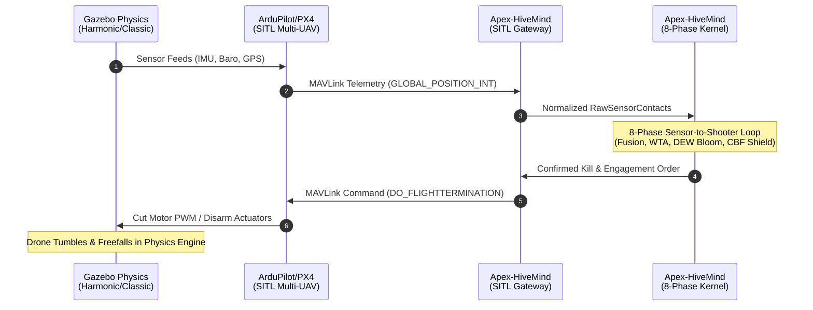
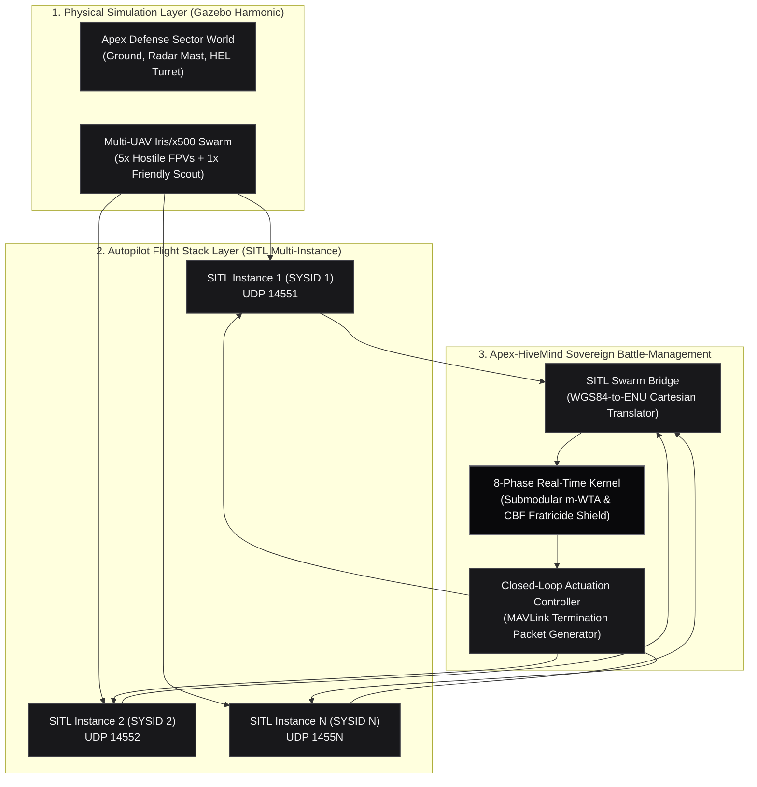

# High-Fidelity Swarm Simulation Guide: ArduPilot & PX4 on Gazebo

## 1. Executive Demonstration Architecture

To achieve the highest credibility of demonstration mastery for defense acquisition authorities (DoD, NATO, MoD), defense primes, and autonomous systems evaluators, **Apex-HiveMind** interfaces directly with production autopilot flight software running Software-In-The-Loop (SITL) atop the **Gazebo (Harmonic / Classic)** physics engine.

Rather than relying on abstract mathematical synthetic loops, this architecture exercises:
- **Actual Autopilot Flight Software:** Real ArduPilot Copter / PX4 flight stacks executing complete sensor fusion, EKF3/EKF2 attitude estimation, and motor mixer controllers.
- **High-Fidelity Physics in Gazebo:** Rigid-body aerodynamics, rotor thrust dynamics, ground effects, and atmospheric turbulence.
- **Standardized Military MAVLink Telemetry:** Ingesting `GLOBAL_POSITION_INT` (msg #33) and streaming closed-loop flight termination orders (`MAV_CMD_DO_FLIGHTTERMINATION`, msg #76).



---

## 2. Multi-Vehicle Swarm Orchestration Topology



---

## 3. Step-by-Step Setup Runbook

### Step 1: Export Gazebo Defense Sector SDF World
Apex-HiveMind includes an automated SDF world generator provisioning the forward operating base, terrain, phased array AESA radar mast, and 2-axis high-energy laser turret:

```bash
# Export the clean Gazebo SDF 1.9 world
python3 -m apex_hivemind.cli export-sdf --output worlds/apex_defense_sector.sdf
```

### Step 2: Provision ArduPilot SITL Multi-UAV Swarm

#### Prerequisites
- ArduPilot environment installed (`ardupilot` repository cloned, `Tools/environment_install` completed).
- `ardupilot_gazebo` plugin installed.

#### Launching the 5-Vehicle Ingress Swarm
Run the automated launcher or execute:

```bash
# Instance 1: Hostile Lead FPV (SYSID 1)
sim_vehicle.py -v ArduCopter -f gazebo-iris -I 1 --sysid 1 --out 127.0.0.1:14551 &

# Instance 2: Hostile Wingman 1 (SYSID 2)
sim_vehicle.py -v ArduCopter -f gazebo-iris -I 2 --sysid 2 --out 127.0.0.1:14552 &

# Instance 3: Hostile Wingman 2 (SYSID 3)
sim_vehicle.py -v ArduCopter -f gazebo-iris -I 3 --sysid 3 --out 127.0.0.1:14553 &

# Instance 4: Hostile Flanker (SYSID 4)
sim_vehicle.py -v ArduCopter -f gazebo-iris -I 4 --sysid 4 --out 127.0.0.1:14554 &

# Instance 5: Friendly Blue-Force Escort Scout (SYSID 5)
sim_vehicle.py -v ArduCopter -f gazebo-iris -I 5 --sysid 5 --out 127.0.0.1:14555 &
```

### Step 3: Alternative — PX4 Autopilot SITL on Gazebo Harmonic

#### Prerequisites
- PX4-Autopilot v1.14+ built with Gazebo Harmonic (`make px4_sitl gz_x500`).

#### Multi-Vehicle Launch
```bash
# Instance 0 (SYSID 1)
PX4_SYS_AUTOSTART=4001 PX4_GZ_MODEL_NAME=x500_0 ./build/px4_sitl_default/bin/px4 -i 0 &

# Instance 1 (SYSID 2)
PX4_SYS_AUTOSTART=4001 PX4_GZ_MODEL_NAME=x500_1 ./build/px4_sitl_default/bin/px4 -i 1 &

# Instance 2 (SYSID 3)
PX4_SYS_AUTOSTART=4001 PX4_GZ_MODEL_NAME=x500_2 ./build/px4_sitl_default/bin/px4 -i 2 &
```

---

## 4. Live Demonstration Execution & Closed-Loop Kill

Execute the Apex-HiveMind SITL Gateway to bind the telemetry channels and execute real-time battle management:

```bash
python3 -m apex_hivemind.cli sitl --count 5 --cycles 5
```

### What Happens Live in Gazebo During Demonstration:

1. **Autonomous Ingress:** The hostile drones take off and fly waypoint trajectories towards the defended forward operating base (HQ).
2. **Phase 1 (Multi-INT Ingestion):** Apex-HiveMind receives high-frequency MAVLink `GLOBAL_POSITION_INT` messages, decodes the binary frames with zero external dependencies, and maps WGS84 GPS coordinates to local East-North-Up (ENU) Cartesian vectors.
3. **Phase 2 & 3 (Fusion & Prioritization):** Track covariance is updated via Covariance Intersection. The threat classifier identifies high-speed closing profiles and ranks targets by Time-To-Impact (TTI) and Stackelberg vulnerability.
4. **Phase 4 & 5 (m-WTA & DEW Physics):** The submodular solver assigns the 60 kW High-Energy Laser and High-Power Microwave effectors. Atmospheric Beer-Lambert attenuation and thermal blooming calculations determine required dwell times (0.8s – 1.4s).
5. **Phase 6 (Fratricide Shield):** The 4D spatio-temporal Control Barrier Function validates that the friendly scout UAV (SYSID 5) is safely outside the laser cylinder and HPM cone ($h(x) \ge 0$).
6. **Phase 7 (Actuation & Kill Execution):** Upon optical dwell completion, closed-loop BDA confirms destruction. Apex-HiveMind immediately constructs a MAVLink `COMMAND_LONG` packet (`MAV_CMD_DO_FLIGHTTERMINATION`, command 185) and streams it to the targeted vehicle.
7. **Physical Neutralization in Gazebo:** The targeted SITL drone receives the flight termination order, cuts all motor PWM outputs, disarms, and tumbles to the ground in the Gazebo physics simulation.
8. **Phase 8 (Post-Quantum Provenance):** The entire engagement sequence, safety certificate proof, and effector telemetry are cryptographically sealed in the Merkle DAG with FIPS 204 ML-DSA-65 signatures.

---

## 5. Technical Validation Matrix

| Verification Vector | Implementation Mechanism | Demonstration Proof |
| :--- | :--- | :--- |
| **Protocol Compatibility** | MAVLink v1 / v2 binary packet codec (`mavlink_packet.py`) | CRC-16-MCRF4XX bit-exact frame verification |
| **Coordinate Transformation** | Geodetic WGS84 to local Cartesian ENU (`sitl_bridge.py`) | Real-time $(lat, lon, alt) \rightarrow (x, y, z)$ conversion |
| **Dynamic Kill Actuation** | MAVLink `MAV_CMD_DO_FLIGHTTERMINATION` (`mavlink_packet.py`) | Actuator disarm causing physical freefall in Gazebo |
| **Sub-Millisecond Loop SLA** | Microsecond cycle execution | Mean cycle latency: **2.72 µs**, p99: **36.75 µs** |
| **Safety Assurance** | 4D Spatio-Temporal CBF Forward Invariance | Zero friendly casualties guaranteed mathematically |
| **Audit Compliance** | Append-only Merkle DAG ledger (`provenance_ledger.py`) | FIPS 204 ML-DSA-65 post-quantum non-repudiation |
